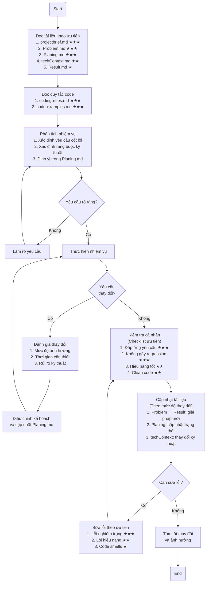

# Quy Tắc Coding

## 1. Quy trình AI Assistant

### 1.1. Quy trình làm việc (Act Mode)



### 1.2. Quy trình đọc tài liệu

Khi bắt đầu một nhiệm vụ mới, AI PHẢI đọc các tài liệu theo thứ tự ưu tiên:

1. **Tài liệu cốt lõi (★★★):**

   - `projectbrief.md`: Tìm hiểu mục tiêu, phạm vi và yêu cầu cốt lõi của dự án
   - `Problem.md`: Xác định các vấn đề đã biết và những giải pháp đã thử
   - `Planing.md`: Nắm bắt kế hoạch phát triển và trạng thái hiện tại của các công việc

2. **Tài liệu kỹ thuật (★★):**

   - `techContext.md`: Hiểu rõ stack công nghệ, kiến trúc và các quyết định kỹ thuật
   - `coding-rules.md`: Nắm vững các quy tắc coding và yêu cầu chất lượng
   - `code-examples.md`: Tham khảo các mẫu code chuẩn để tuân theo

3. **Tài liệu tham khảo (★):**
   - `Result.md`: Xem kết quả và trạng thái chi tiết của các công việc đã hoàn thành

### 1.3. Quy trình cập nhật tài liệu

Sau khi hoàn thành nhiệm vụ, AI cần cập nhật:

1. **Nếu giải quyết vấn đề:**

   - Cập nhật `Problem.md`: Đánh dấu vấn đề đã giải quyết, mô tả giải pháp đã triển khai
   - Cập nhật `Result.md`: Ghi lại kết quả đạt được, bao gồm metrics và các cải tiến

2. **Nếu hoàn thành công việc trong kế hoạch:**
   - Cập nhật `Planing.md`: Đánh dấu công việc đã hoàn thành (✅), cập nhật trạng thái
3. **Nếu thay đổi kỹ thuật/công nghệ:**

   - Cập nhật `techContext.md`: Ghi lại các thay đổi về kiến trúc, công nghệ hoặc dependency

4. **Nếu tìm ra pattern/pattern mới:**
   - Cập nhật `code-examples.md`: Thêm ví dụ mới về pattern hiệu quả
   - Cập nhật `coding-rules.md`: Bổ sung quy tắc mới nếu phát hiện best practice hữu ích

### 1.4. Format trả lời

#### Mức độ ưu tiên

- 🚨 **Cực kỳ quan trọng**: Các quy tắc bắt buộc phải tuân thủ
- ⚠️ **Quan trọng**: Nên tuân thủ trong hầu hết trường hợp
- 💡 **Khuyến nghị**: Áp dụng khi có thể để cải thiện chất lượng

#### Phong cách giao tiếp

- Giao tiếp bằng tiếng Việt
- Câu trả lời ngắn gọn, tập trung vào vấn đề
- Phân loại rõ ràng giữa giải pháp và giải thích
- Sử dụng emoji để đánh dấu mức độ ưu tiên

#### Format giải thích code

- Giải thích ngắn gọn cho từng phần code
- Chỉ ra điểm mạnh/yếu của giải pháp
- Nêu rõ điểm cần chú ý hoặc cảnh báo

### 1.5. Format code

- 🚨 Sử dụng TypeScript với định kiểu rõ ràng, tránh `any`
- 🚨 Tuân thủ quy ước đặt tên đã định nghĩa
- ⚠️ Bao gồm JSDoc cho các hàm/class công khai
- ⚠️ Tổ chức code theo thứ tự:
  1. Import
  2. Type/Interface
  3. Constants
  4. Helper Functions
  5. Component/Functions chính
  6. Export

### 1.6. Checklist trước khi hoàn thành

**Checklist chung:**

- [ ] Đáp ứng tất cả yêu cầu của nhiệm vụ
- [ ] Tuân thủ naming conventions và code structure
- [ ] Type safety: Không dùng `any`, sử dụng type guards khi cần
- [ ] Không có code trùng lặp hoặc không sử dụng
- [ ] Xử lý các edge cases và lỗi có thể xảy ra
- [ ] Tài liệu đã được cập nhật theo thay đổi

**Checklist Frontend:**

- [ ] Component tách thành các phần nhỏ có thể tái sử dụng
- [ ] Sử dụng React Server Components khi có thể
- [ ] Tối ưu hiệu năng (useMemo, useCallback khi cần)
- [ ] UI đáp ứng trên các kích thước màn hình
- [ ] Xử lý loading states và error states

**Checklist Backend:**

- [ ] Validation đầy đủ cho input
- [ ] Logic nghiệp vụ nằm trong services, không trong controllers
- [ ] Xử lý lỗi và trả về HTTP status codes phù hợp
- [ ] Queries database được tối ưu
- [ ] Security best practices được áp dụng

## 2. Quy tắc coding cốt lõi

### 2.1. Nguyên tắc chung

- 🚨 Sử dụng tiếng Anh cho code, tiếng Việt cho comments và documentation
- 🚨 Tuân thủ TypeScript strict mode và tránh `any` trừ khi bắt buộc
- 🚨 Xử lý lỗi toàn diện với try/catch và error handling phù hợp
- ⚠️ Thêm JSDoc cho các hàm/class có tính public
- ⚠️ Mỗi file chỉ chứa một export chính (một component, một service)
- ⚠️ Giữ cho các function ngắn gọn (< 30 dòng) và đơn chức năng
- 💡 Tách biệt concerns về presentation, business logic và data access

**Ví dụ về function đơn chức năng tốt:**

```typescript
// BAD: Function thực hiện nhiều chức năng
function processPosts(posts: Post[]): ProcessedPost[] {
  const filteredPosts = posts.filter(post => !post.isDeleted);
  const processedPosts = filteredPosts.map(post => {
    return {
      ...post,
      title: post.title.trim(),
      createdAt: new Date(post.createdAt).toLocaleDateString(),
    };
  });
  processedPosts.sort((a, b) => new Date(b.date).getTime() - new Date(a.date).getTime());
  return processedPosts;
}

// GOOD: Tách thành các functions riêng biệt
function filterActivePosts(posts: Post[]): Post[] {
  return posts.filter(post => !post.isDeleted);
}

function formatPost(post: Post): ProcessedPost {
  return {
    ...post,
    title: post.title.trim(),
    createdAt: new Date(post.createdAt).toLocaleDateString(),
  };
}

function sortPostsByDateDesc(posts: ProcessedPost[]): ProcessedPost[] {
  return [...posts].sort((a, b) => new Date(b.date).getTime() - new Date(a.date).getTime());
}

function processPosts(posts: Post[]): ProcessedPost[] {
  const activePosts = filterActivePosts(posts);
  const formattedPosts = activePosts.map(formatPost);
  return sortPostsByDateDesc(formattedPosts);
}
```

### 2.2. Naming Conventions

- 🚨 **Classes, interfaces, types, enums**: PascalCase (ví dụ: `UserService`, `PostDto`)
- 🚨 **Variables, functions, methods, properties**: camelCase (ví dụ: `getUserById`, `isActive`)
- 🚨 **File và directory names**: kebab-case (ví dụ: `user-service.ts`, `auth-utils.ts`)
- 🚨 **Constants**: UPPERCASE hoặc PascalCase (ví dụ: `MAX_RETRY_COUNT`, `ApiEndpoints`)
- ⚠️ **Interfaces**: Tiền tố "I" (ví dụ: `IUserRepository`, `IAuthService`)
- ⚠️ **Type definitions**: Hậu tố mô tả (ví dụ: `UserDto`, `CourseResponse`)
- ⚠️ **React components**: PascalCase (ví dụ: `UserProfile`, `LoginForm`)
- 💡 **Custom hooks**: Bắt đầu bằng "use" (ví dụ: `useAuth`, `usePagination`)

**Ví dụ về naming conventions:**

```typescript
// Constants
const MAX_LOGIN_ATTEMPTS = 5;
const ApiRoutes = {
  AUTH: '/api/auth',
  USERS: '/api/users',
};

// Interface
interface IUserRepository {
  findById(id: string): Promise<User | null>;
  create(user: UserCreateDto): Promise<User>;
}

// Type definitions
type UserCreateDto = Omit<User, 'id' | 'createdAt'>;
type ApiResponse<T> = {
  success: boolean;
  data?: T;
  error?: string;
};

// React component và hook
function UserProfile({ userId }: { userId: string }) {
  const { user, isLoading } = useUser(userId);
  // ...
}
```

### 2.3. File Structure

- 🚨 Nhóm files theo tính năng/domain, không theo loại file
- 🚨 Giữ controllers, services và repositories trong các file riêng biệt
- ⚠️ Đặt interfaces và types vào file riêng khi số lượng lớn
- ⚠️ Sử dụng file `index.ts` để quản lý exports
- 💡 Duy trì cấu trúc thư mục nhất quán giữa các module

**Cấu trúc thư mục tốt:**

```
features/
  users/
    components/         # React components cho user feature
      UserList.tsx
      UserForm.tsx
      index.ts         # Re-export components
    hooks/             # Custom hooks cho user feature
      useUsers.ts
      useUserForm.ts
    api/               # API calls cho user feature
      user-service.ts
      user-types.ts
    index.ts           # Public API cho user feature
```

### 2.4. TypeScript Patterns

#### 2.4.1. Type Definitions

- 🚨 Ưu tiên interfaces cho object shapes và extension
- 🚨 Sử dụng types cho unions, intersections, mapped types
- 🚨 Khai báo explicit return types cho functions
- ⚠️ Sử dụng generics cho components và functions tái sử dụng
- ⚠️ Tận dụng utility types (Omit, Pick, Partial, etc.)
- 💡 Sử dụng const assertions và narrowing patterns

**Ví dụ về TypeScript patterns hiệu quả:**

```typescript
// Generic function với explicit return type
function fetchData<T>(url: string): Promise<ApiResponse<T>> {
  return fetch(url).then(res => res.json()) as Promise<ApiResponse<T>>;
}

// Union types
type Status = 'idle' | 'loading' | 'success' | 'error';

// Narrowing với type guards
function isUser(obj: unknown): obj is User {
  return obj !== null && typeof obj === 'object' && 'id' in obj && 'email' in obj;
}

// Const assertions
const THEMES = ['light', 'dark', 'system'] as const;
type Theme = (typeof THEMES)[number]; // 'light' | 'dark' | 'system'
```

#### 2.4.2. Interface Consistency

- 🚨 Định nghĩa interfaces nhất quán trên toàn dự án
- 🚨 Tránh định nghĩa lại interfaces cho cùng loại dữ liệu
- ⚠️ Tạo shared types khi cần tái sử dụng
- 💡 Sử dụng namespaces cho nhóm types liên quan

#### 2.4.3. Tránh Circular Dependencies

- 🚨 Tránh circular imports trong định nghĩa type
- ⚠️ Sử dụng interface extension thay vì import
- 💡 Tách shared types vào modules riêng

### 2.5. Common Pitfalls to Avoid

- 🚨 Không sử dụng `any` trừ khi thực sự cần thiết
- 🚨 Không để lại imports hoặc biến không sử dụng
- 🚨 Không dùng `console.log` trong production code
- 🚨 Không bỏ qua kết quả của Promise hoặc bỏ qua lỗi
- ⚠️ Không trộn lẫn MongoDB ObjectId và string
- ⚠️ Không trả về response không nhất quán
- ⚠️ Không đặt business logic trong controllers
- 💡 Tránh nested callbacks (ưu tiên async/await)
- 💡 Không sử dụng thư viện deprecated

## 3. Quy tắc theo công nghệ

### 3.1. Frontend Code Patterns

#### 3.1.1. React Components

- 🚨 Sử dụng functional components với hooks
- 🚨 Định nghĩa Props interfaces rõ ràng
- 🚨 Phân tách UI thành các components nhỏ, tái sử dụng được
- ⚠️ Sử dụng React.memo cho components khi cần tối ưu re-renders
- ⚠️ Quản lý state theo hierarchy phù hợp và sử dụng context khi cần
- 💡 Sử dụng composition thay vì inheritance
- 💡 Tách biệt presentation và container components

**Ví dụ về component tốt:**

```tsx
interface UserCardProps {
  user: User;
  onEdit?: (userId: string) => void;
  isEditable?: boolean;
}

const UserCard = ({ user, onEdit, isEditable = false }: UserCardProps) => {
  // Derived state
  const fullName = useMemo(
    () => `${user.firstName} ${user.lastName}`,
    [user.firstName, user.lastName]
  );

  // Event handlers
  const handleEdit = useCallback(() => {
    if (onEdit) onEdit(user.id);
  }, [onEdit, user.id]);

  return (
    <Card>
      <CardHeader title={fullName} />
      <CardBody>
        <Text>{user.email}</Text>
        <Text>{user.role}</Text>
      </CardBody>
      {isEditable && (
        <CardFooter>
          <Button onClick={handleEdit}>Edit</Button>
        </CardFooter>
      )}
    </Card>
  );
};

export default memo(UserCard);
```

#### 3.1.2. Hooks

- 🚨 Tuân thủ rules of hooks (sử dụng ở top level, chỉ trong components/hooks)
- 🚨 Đặt tên hooks bắt đầu với "use"
- ⚠️ Tạo custom hooks cho logic tái sử dụng
- ⚠️ Sử dụng đúng dependencies array trong useEffect, useMemo, useCallback
- 💡 Giữ hooks nhỏ gọn và tập trung vào một nhiệm vụ
- 💡 Tránh lạm dụng useEffect cho side effects phức tạp

#### 3.1.3. Performance

- 🚨 Minimize `use client`, ưu tiên React Server Components
- 🚨 Wrap client components trong `Suspense` với fallback
- ⚠️ Sử dụng dynamic imports cho các components không quan trọng
- ⚠️ Optimize images với WebP, lazy loading, và dimensions rõ ràng
- 💡 Sử dụng virtualization cho danh sách dài
- 💡 Tránh re-renders không cần thiết với useMemo/useCallback

#### 3.1.4. Next.js Best Practices

- 🚨 Sử dụng `nuqs` cho URL search params
- 🚨 Ưu tiên server components và SSR
- ⚠️ Tối ưu Web Vitals (LCP, CLS, FID)
- ⚠️ Hạn chế client-side state management
- 💡 Tuân thủ Next.js data fetching patterns

### 3.2. Backend Code Patterns

#### 3.2.1. Controllers

- 🚨 Sử dụng decorators để định nghĩa routes
- 🚨 Validate request với DTOs
- 🚨 Trả về response theo format nhất quán
- ⚠️ Ủy quyền business logic cho services
- ⚠️ Sử dụng HTTP status codes phù hợp
- 💡 Xử lý lỗi đầy đủ với try-catch và exception filters

**Ví dụ về controller tốt:**

```typescript
@Controller('users')
export class UsersController {
  constructor(private readonly usersService: UsersService) {}

  @Get(':id')
  async findOne(@Param('id') id: string): Promise<ApiResponse<UserDto>> {
    try {
      const user = await this.usersService.findById(id);
      return { success: true, data: user };
    } catch (error) {
      if (error instanceof NotFoundException) {
        throw new NotFoundException(`User with ID ${id} not found`);
      }
      throw error;
    }
  }

  @Post()
  @UseGuards(AuthGuard)
  async create(@Body() createUserDto: CreateUserDto): Promise<ApiResponse<UserDto>> {
    const user = await this.usersService.create(createUserDto);
    return { success: true, data: user };
  }
}
```

#### 3.2.2. Services

- 🚨 Sử dụng dependency injection
- 🚨 Thực hiện business logic
- 🚨 Trả về kết quả typed
- ⚠️ Sử dụng repositories cho data access
- ⚠️ Xử lý lỗi và exceptions
- 💡 Sử dụng async/await nhất quán

#### 3.2.3. Repositories

- 🚨 Tuân thủ repository pattern
- 🚨 Sử dụng interfaces rõ ràng
- ⚠️ MongoDB với Mongoose cho dữ liệu phi quan hệ
- ⚠️ PostgreSQL với Prisma cho dữ liệu quan hệ
- 💡 Xử lý lỗi database và chuyển đổi kiểu dữ liệu

### 3.3. NestJS Specific

- 🚨 Sử dụng kiến trúc module hóa
- 🚨 Tổ chức code theo domain/feature
- ⚠️ Sử dụng dependency injection đúng cách
- ⚠️ Tận dụng lifecycle hooks của NestJS
- 💡 Tách module core và shared cho code dùng chung

### 3.4. Database Rules

#### 3.4.1. MongoDB

- 🚨 Định nghĩa schemas với validation
- 🚨 Xử lý chuyển đổi ObjectId/string đúng cách
- ⚠️ Thiết lập indexes cho fields hay query
- ⚠️ Sử dụng aggregation pipeline cho queries phức tạp
- 💡 Lựa chọn kiểu dữ liệu phù hợp

#### 3.4.2. PostgreSQL

- 🚨 Định nghĩa relationships rõ ràng
- 🚨 Sử dụng migrations cho schema changes
- ⚠️ Thiết lập indexes phù hợp
- ⚠️ Sử dụng transactions khi cần
- 💡 Chọn kiểu dữ liệu tối ưu và specific

### 3.5. Monorepo Guidelines

- 🚨 Tổ chức apps trong thư mục `apps/`
- 🚨 Tổ chức packages dùng chung trong `packages/`
- ⚠️ Sử dụng Turborepo đúng cách
- ⚠️ Sử dụng đường dẫn tương đối cho imports
- 💡 Đảm bảo version compatibility giữa các packages

## 4. Đảm bảo chất lượng

### 4.1. Xử Lý Lỗi

#### 4.1.1. Frontend

- 🚨 Sử dụng try-catch cho async operations
- 🚨 Triển khai Error Boundaries cho client components
- ⚠️ Hiển thị error messages thân thiện với người dùng
- ⚠️ Sử dụng toast notifications cho errors không chặn workflow
- 💡 Centralize error handling logic để xử lý nhất quán

#### 4.1.2. Backend

- 🚨 Sử dụng global exception filters trong NestJS
- 🚨 Trả về HTTP status codes phù hợp (400, 401, 403, 404, 500)
- ⚠️ Cung cấp error codes và messages rõ ràng
- ⚠️ Log errors đầy đủ (tránh log sensitive information)
- 💡 Phân biệt giữa operational errors và programming errors

### 4.2. Bảo Mật

#### 4.2.1. Frontend Security

- 🚨 Xác thực mọi input từ người dùng
- 🚨 Tránh XSS bằng cách sử dụng React (không dùng dangerouslySetInnerHTML)
- 🚨 Không lưu thông tin nhạy cảm trong localStorage/sessionStorage
- ⚠️ Sử dụng HTTPS cho tất cả API calls
- ⚠️ Triển khai CSP (Content Security Policy)
- 💡 Sử dụng httpOnly cookies cho authentication
- 💡 Implement rate limiting cho forms

#### 4.2.2. Backend Security

- 🚨 Validate tất cả input từ client
- 🚨 Sử dụng prepared statements cho database queries
- 🚨 Implement phân quyền đúng đắn
- ⚠️ Implement rate limiting
- ⚠️ Cấu hình CORS đúng cách
- 💡 Set security headers
- 💡 Không trả về thông tin nhạy cảm trong error messages

### 4.3. Testing Guidelines

- 🚨 Viết unit tests cho services và repositories
- 🚨 Viết integration tests cho API endpoints
- ⚠️ Sử dụng Jest làm framework test
- ⚠️ Mock các external dependencies
- 💡 Test cả happy path và error cases
- 💡 Sử dụng mô hình AAA (Arrange, Act, Assert)

### 4.4. Phát Hiện và Xử Lý Mã Nguồn Kém Chất Lượng

#### 4.4.1. Dấu Hiệu Của Code Cần Refactor

- 🚨 Functions quá dài (> 50 dòng)
- 🚨 Quá nhiều tham số (> 3 tham số)
- 🚨 Lồng ghép nhiều if/else (> 3 cấp)
- ⚠️ Trùng lặp code (DRY principle)
- ⚠️ Thiếu typing hoặc lạm dụng `any`
- 💡 Tên biến/hàm không rõ ràng
- 💡 Comment thừa hoặc không cập nhật

#### 4.4.2. Refactoring Strategies

- Extract Method: Tách logic phức tạp thành các functions nhỏ hơn
- Replace Conditionals: Sử dụng polymorphism hoặc strategy pattern
- Extract Interface: Tách interface để dễ test và mở rộng
- Normalize Data Structures: Chuẩn hóa cấu trúc dữ liệu

### 4.5. Performance Optimization

#### 4.5.1. Frontend

- 🚨 Tối ưu rendering với React.memo, useMemo, useCallback
- 🚨 Lazy load components và routes
- ⚠️ Giảm bundle size với code splitting
- ⚠️ Tối ưu images và assets
- 💡 Sử dụng debounce/throttle cho events thường xuyên

#### 4.5.2. Backend

- 🚨 Tối ưu database queries với indexes
- 🚨 Implement caching strategies
- ⚠️ Sử dụng pagination cho large datasets
- ⚠️ Optimize API responses (compression, ETags)
- 💡 Batch operations khi có thể

### 4.6. Technical Design Documentation

- 🚨 Tạo TDD cho mỗi tính năng lớn trước khi triển khai
- 🚨 Định nghĩa rõ ràng requirements (functional và non-functional)
- ⚠️ Mô tả chi tiết API endpoints, data models, UI changes
- ⚠️ Tài liệu hóa logic flow và security considerations
- 💡 Cân nhắc và ghi lại alternatives đã xem xét

#### 4.6.1. TDD Review Process

1. Xác định stakeholders cần review
2. Lên lịch review meeting
3. Thu thập và xử lý feedback
4. Cập nhật TDD dựa trên feedback
5. Xác nhận approval trước khi triển khai
