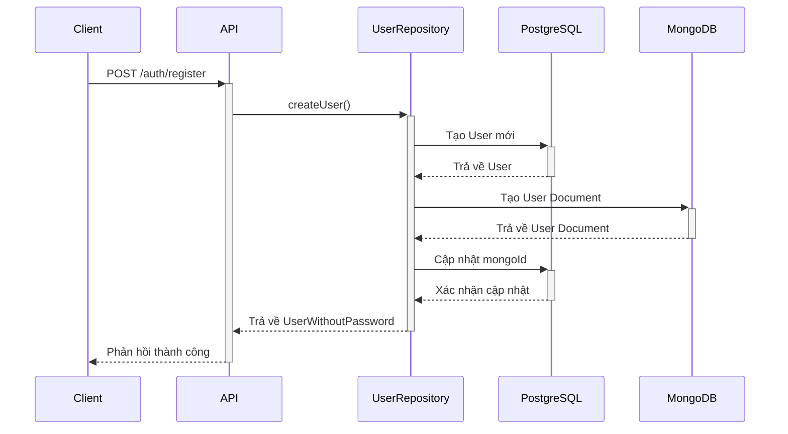
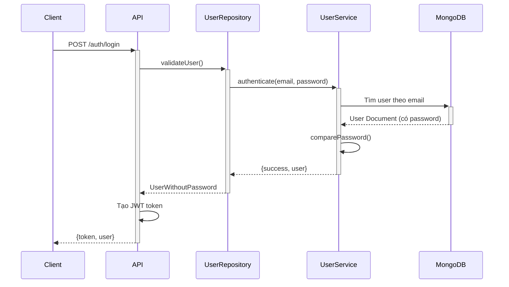
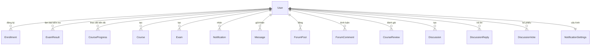

# Model Users trong NyNus

Hệ thống NyNus sử dụng thiết kế cơ sở dữ liệu lai bao gồm cả MongoDB và PostgreSQL để lưu trữ dữ liệu người dùng. Dưới đây là thông tin chi tiết về mô hình User.

## I. Tổng quan

Hệ thống lưu trữ dữ liệu người dùng ở hai cơ sở dữ liệu:

- **PostgreSQL**: Lưu trữ dữ liệu cơ bản và quan hệ chính
- **MongoDB**: Lưu trữ dữ liệu chi tiết và linh hoạt hơn

Mỗi người dùng trong PostgreSQL có thể tham chiếu đến một document trong MongoDB thông qua trường `mongoId`, và ngược lại, mỗi người dùng trong MongoDB có thể tham chiếu đến một bản ghi trong PostgreSQL thông qua trường `postgresId`.

### Mối quan hệ giữa các hệ thống lưu trữ

Hệ thống sử dụng thiết kế cơ sở dữ liệu lai (hybrid database design) với chiến lược đồng bộ hóa hai chiều:

```
PostgreSQL <-----> Đồng bộ hóa <-----> MongoDB
    ^                                     ^
    |                                     |
Dữ liệu quan hệ                    Dữ liệu chi tiết
& các ràng buộc                    & cấu trúc linh hoạt
```

Quá trình đồng bộ hóa được thực hiện như sau:

1. **Tạo mới**: Khi tạo mới người dùng, hệ thống ghi vào PostgreSQL trước, sau đó tạo document trong MongoDB và cập nhật tham chiếu qua lại.
2. **Cập nhật**: Khi cập nhật, tùy thuộc vào trường dữ liệu mà hệ thống quyết định cập nhật ở đâu:
   - Trường đồng bộ: Cập nhật ở cả hai nơi
   - Trường chuyên biệt: Chỉ cập nhật ở CSDL chính quản lý trường đó
3. **Xung đột**: Nếu có xung đột, ưu tiên dữ liệu từ PostgreSQL (theo cấu hình)

## II. Mô hình User trong MongoDB

### Interface IUser (User.ts)

```typescript
export interface IUser extends Document {
  email: string;
  password: string;
  role: UserRole;
  status: UserStatus;
  profile: UserProfile;
  settings: UserSettings;
  learningData: UserLearningData;
  lastLogin?: Date;
  createdAt: Date;
  updatedAt: Date;
  postgresId?: string; // ID tham chiếu đến bản ghi trong PostgreSQL
  comparePassword(candidatePassword: string): Promise<boolean>;
}
```

### Enums

```typescript
// Vai trò người dùng
export enum UserRole {
  STUDENT = 'student',
  TEACHER = 'teacher',
  ADMIN = 'admin',
}

// Trạng thái người dùng
export enum UserStatus {
  ACTIVE = 'active',
  INACTIVE = 'inactive',
  SUSPENDED = 'suspended',
  PENDING_VERIFICATION = 'pending_verification',
}
```

### Interface UserProfile

```typescript
export interface UserProfile {
  firstName: string;
  lastName: string;
  bio?: string;
  avatar?: string;
  phoneNumber?: string;
  dateOfBirth?: Date;
  address?: {
    street?: string;
    city?: string;
    state?: string;
    zipCode?: string;
    country?: string;
  };
  education?: {
    school?: string;
    degree?: string;
    fieldOfStudy?: string;
    from?: Date;
    to?: Date;
    current?: boolean;
  }[];
  socialLinks?: {
    facebook?: string;
    twitter?: string;
    linkedin?: string;
    github?: string;
    website?: string;
  };
}
```

### Interface UserSettings

```typescript
export interface UserSettings {
  notifications: {
    email: boolean;
    push: boolean;
    sms: boolean;
  };
  theme: 'light' | 'dark' | 'system';
  language: string;
  accessibility: {
    highContrast: boolean;
    largeText: boolean;
  };
}
```

### Interface UserLearningData

```typescript
export interface UserLearningData {
  strengths: string[]; // Các chủ đề mạnh
  weaknesses: string[]; // Các chủ đề yếu
  learningStyle?: string; // Phong cách học tập
  preferredSubjects?: string[]; // Môn học ưa thích
  studyGoals?: string[]; // Mục tiêu học tập
  studyReminders?: {
    time: Date;
    days: string[]; // Các ngày trong tuần
    enabled: boolean;
  }[];
}
```

### Schema MongoDB

Schema cho User trong MongoDB có các đặc điểm sau:

- Yêu cầu email, password, firstName và lastName
- Password được hash tự động thông qua middleware trước khi lưu
- Có phương thức `comparePassword` để xác thực
- Lưu trữ nhiều thông tin chi tiết về người dùng

## III. Mô hình User trong PostgreSQL

### Schema Prisma

```prisma
model User {
  id            String    @id @default(uuid())
  email         String    @unique
  passwordHash  String
  role          Role      @default(STUDENT)
  status        UserStatus @default(PENDING_VERIFICATION)

  // Thông tin cơ bản
  firstName     String
  lastName      String

  // Timestamps
  createdAt     DateTime  @default(now())
  updatedAt     DateTime  @updatedAt
  lastLogin     DateTime?

  // Metadata
  mongoId       String?    // ID tham chiếu đến document trong MongoDB

  // Quan hệ với các bảng khác
  enrollments   Enrollment[]
  examResults   ExamResult[]
  courseProgress CourseProgress[]
  createdCourses Course[]     @relation("CourseCreator")
  createdExams  Exam[]       @relation("ExamCreator")
  notifications Notification[]
  notificationActions Notification[] @relation("NotificationAction")
  notificationSettings NotificationSettings?
  sentMessages  Message[]    @relation("MessageSender")
  receivedMessages Message[] @relation("MessageReceiver")
  forumPosts    ForumPost[]
  forumComments ForumComment[]
  courseReviews CourseReview[]
  discussions   Discussion[]
  discussionReplies DiscussionReply[]
  discussionVotes   DiscussionVote[]

  @@map("users")
}

enum Role {
  STUDENT
  TEACHER
  ADMIN
}

enum UserStatus {
  ACTIVE
  INACTIVE
  SUSPENDED
  PENDING_VERIFICATION
}
```

## IV. Các Interface liên quan đến User

### UserDocument (user.model.ts)

```typescript
export interface UserDocument extends Document {
  _id: mongoose.Types.ObjectId;
  email: string;
  password: string;
  fullName: string;
  role: 'student' | 'teacher' | 'admin';
  avatar?: string;
  createdAt: Date;
  updatedAt: Date;
}
```

### UserWithMongoId

```typescript
export interface UserWithMongoId {
  id: string;
  email: string;
  passwordHash: string;
  role: Role;
  status: UserStatus;
  firstName: string;
  lastName: string;
  createdAt: Date;
  updatedAt: Date;
  lastLogin: Date | null;
  mongoId: string | null;
}
```

### CreateUserInput

```typescript
export interface CreateUserInput {
  email: string;
  password: string;
  firstName: string;
  lastName: string;
  role?: Role;
  status?: UserStatus;
}
```

### UpdateUserInput

```typescript
export interface UpdateUserInput {
  email?: string;
  password?: string;
  firstName?: string;
  lastName?: string;
  role?: Role;
  status?: UserStatus;
  mongoId?: string | null;
}
```

## V. Repository Methods

Interface IUserRepository định nghĩa các phương thức để tương tác với dữ liệu User:

```typescript
export interface IUserRepository {
  // User operations
  createUser(data: CreateUserInput): Promise<UserWithoutPassword | null>;
  updateUser(id: MongoId, data: UpdateUserInput): Promise<UserWithoutPassword | null>;
  updateUserProfile(id: MongoId, data: UpdateUserProfileInput): Promise<UserWithoutPassword | null>;
  deleteUser(id: MongoId): Promise<UserWithoutPassword | null>;
  findUserById(id: MongoId): Promise<UserWithoutPassword | null>;
  findUserByEmail(email: string): Promise<UserWithoutPassword | null>;
  findUsers(filters: UserFilters, page: number, limit: number): Promise<UserListResult>;

  // Authentication operations
  validateUser(email: string, password: string): Promise<UserWithoutPassword | null>;
  changePassword(id: MongoId, currentPassword: string, newPassword: string): Promise<boolean>;
  requestPasswordReset(email: string): Promise<string | null>; // returns reset token
  resetPassword(token: string, newPassword: string): Promise<boolean>;

  // Role management
  updateUserRole(id: MongoId, role: string): Promise<UserWithoutPassword | null>;

  // User stats and info
  getUserStats(): Promise<UserStatsResult>;

  // User verification
  verifyEmail(token: string): Promise<boolean>;
  resendVerificationEmail(userId: MongoId): Promise<boolean>;

  // Profile operations
  getUserProfile(userId: MongoId): Promise<UserWithoutPassword | null>;
  updateAvatar(userId: MongoId, avatarUrl: string): Promise<UserWithoutPassword | null>;
}
```

### Luồng dữ liệu User

#### Tạo mới người dùng



#### Xác thực người dùng



## VI. Phân quyền dữ liệu

Theo cấu hình `data-ownership.js`, dữ liệu người dùng có cấu trúc phân quyền như sau:

- **Cơ sở dữ liệu chính**: PostgreSQL
- **Cơ sở dữ liệu phụ**: MongoDB
- **Đồng bộ hai chiều**: Có
- **Ưu tiên khi xung đột**: PostgreSQL
- **Trường đối chiếu**: email
- **Các trường đồng bộ**: ['email', 'role', 'firstName', 'lastName', 'fullName']
- **Trường chỉ có trong cơ sở dữ liệu chính**: ['passwordHash', 'status', 'lastLogin']
- **Trường chỉ có trong cơ sở dữ liệu phụ**: ['password']

### Quy trình đồng bộ hóa

Hệ thống thực hiện đồng bộ hóa dữ liệu người dùng như sau:

1. **Đồng bộ MongoDB -> PostgreSQL**:

   - Phát hiện thay đổi trong MongoDB (thông qua Change Streams hoặc kiểm tra định kỳ)
   - Lọc các trường cần đồng bộ (email, role, firstName, lastName, fullName)
   - Cập nhật vào PostgreSQL dựa trên trường tham chiếu postgresId

2. **Đồng bộ PostgreSQL -> MongoDB**:

   - Phát hiện thay đổi trong PostgreSQL (thông qua triggers hoặc kiểm tra định kỳ)
   - Lọc các trường cần đồng bộ
   - Cập nhật vào MongoDB dựa trên trường tham chiếu mongoId

3. **Xử lý xung đột**:
   - Nếu cùng một trường được cập nhật ở cả hai nơi, ưu tiên giá trị từ PostgreSQL
   - Sử dụng timestamps để xác định phiên bản mới nhất khi có xung đột

## VII. Phương thức bảo mật

### Bảo mật mật khẩu

1. **Hash mật khẩu**:

   ```typescript
   // Middleware để hash password trước khi lưu
   UserSchema.pre('save', async function (next) {
     // Chỉ hash password nếu nó được sửa đổi hoặc là mới
     if (!this.isModified('password')) return next();

     try {
       // Tạo salt và hash password
       const salt = await bcrypt.genSalt(10);
       this.password = await bcrypt.hash(this.password, salt);
       next();
     } catch (error: any) {
       next(error);
     }
   });
   ```

2. **So sánh mật khẩu**:

   ```typescript
   // Method để so sánh password
   UserSchema.methods.comparePassword = async function (
     candidatePassword: string
   ): Promise<boolean> {
     try {
       return await bcrypt.compare(candidatePassword, this.password);
     } catch (error) {
       return false;
     }
   };
   ```

3. **Quy trình xác thực**:

   - Client gửi thông tin đăng nhập (email, password)
   - Server tìm người dùng theo email
   - So sánh mật khẩu đã hash với mật khẩu được gửi
   - Nếu khớp, tạo JWT token và trả về cho client
   - Token được sử dụng cho các yêu cầu tiếp theo

4. **Reset mật khẩu**:
   - Người dùng yêu cầu reset mật khẩu (gửi email)
   - Hệ thống tạo token reset mật khẩu (có hạn sử dụng)
   - Gửi token qua email
   - Người dùng sử dụng token để đặt lại mật khẩu

## VIII. Sơ đồ mối quan hệ User với các Entity khác



### Mô tả các mối quan hệ chính

1. **Course**: Người dùng có thể tạo khóa học (vai trò giáo viên) hoặc đăng ký học (vai trò học sinh)
2. **Exam**: Người dùng có thể tạo đề thi hoặc làm bài thi
3. **Discussion**: Người dùng có thể tạo thảo luận, trả lời và bỏ phiếu
4. **Message**: Người dùng có thể gửi và nhận tin nhắn
5. **Notification**: Người dùng nhận thông báo và có thể cấu hình cài đặt thông báo

## IX. UserLearningStats

```typescript
class UserLearningStats {
  totalCoursesEnrolled: number;
  completedCourses: number;
  inProgressCourses: number;
  totalExamsTaken: number;
  averageExamScore: number;
  totalLessonsCompleted: number;
  strongSubjects: string[];
  weakSubjects: string[];
  learningPace: number;
}
```

### Hệ thống theo dõi và đánh giá

Hệ thống theo dõi tiến trình học tập của người dùng thông qua:

1. **Đăng ký khóa học**: Thống kê số lượng và loại khóa học đã đăng ký
2. **Hoàn thành bài học**: Theo dõi tỷ lệ hoàn thành và thời gian học
3. **Kết quả kiểm tra**: Phân tích điểm số và xác định điểm mạnh/yếu
4. **Tốc độ học tập**: Đánh giá tốc độ hoàn thành và mức độ tương tác

Dữ liệu này được sử dụng để:

- Gợi ý khóa học phù hợp
- Điều chỉnh nội dung học tập
- Cung cấp báo cáo tiến trình
- Hỗ trợ cải thiện điểm yếu

## X. Khác

- **NotificationSettings**: Lưu trữ cấu hình thông báo của người dùng
- **Authentication**: Sử dụng bcrypt để hash và so sánh mật khẩu
- **Verification Email**: Hỗ trợ xác minh email thông qua token
- **Audit Logging**: Theo dõi các thay đổi quan trọng đối với tài khoản người dùng
- **GDPR Compliance**: Cung cấp cơ chế để người dùng tải xuống hoặc xóa dữ liệu cá nhân
